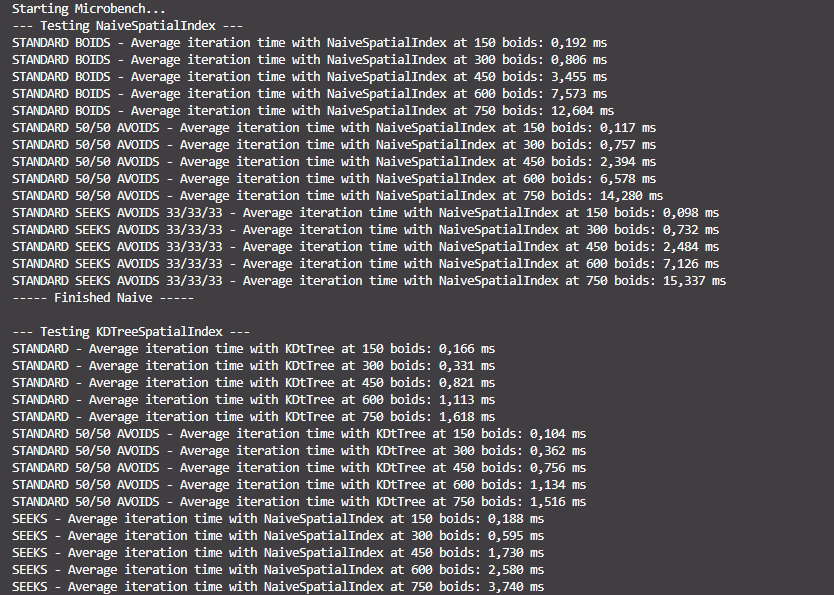

Jeg implementerede BehaviorStrategy i FlockBehavior, og refaktorerede kald på koordinater, som nu skal kaldes af en ny Boid parameter. 
Jeg har ændret BoidType til at have flere farver. Boid klassen har fået et ekstra field til sin behavior.  

Jeg har lavet to nye behaviors. AvoidanceBehvaior holder sig væk fra to punkter, sat ca. 1/3 inde fra venstre og højre side. Ved samme punkter har jeg lagt Food, som SeeksBehavior søger efter. Jeg ville gerne have haft det sådan at food ville blive spist, og dukke op nye steder. Det blev dog lidt indviklet til sidst, med hvor de "spise" kald så skulle ligge.

### Microbenching:
Mine tanker var at den Naive spatial index ville stige med den samme mængde tid, lige meget hvilken opsætning af boids jeg kørte. Det var også hvad jeg fandt frem til. Der var en lille stigning i frametime når typerne var mere divers, men det tror jeg bare er min kode som tilføjer flere boids, end hvad boidsCount er. Jeg dividere og floor nok ikke rigtigt.

Noget spændende at se i mine benchmarks, var at KDTree mister sin effektivitet ved store grupperinger. Dette viste sig ved gentagne målinger. 

Det sker fordi, at mine seeker boids desværre ender i tættte sværme omkring food, da det ikke forsvinder. Derfor kommer KDTree meget tættere på O(n^2) her. 
Udover det viste KDTree sig til at være betydeligt bedre end den Naive.

